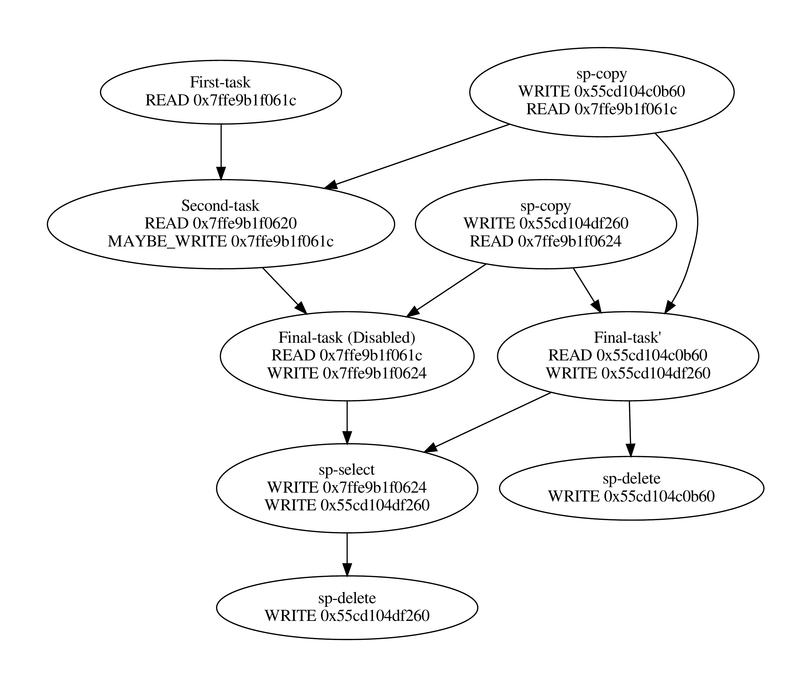

[](https://gitlab.inria.fr/bramas/spetabaru/commits/master)
[](https://gitlab.inria.fr/bramas/spetabaru/commits/master)


# Introduction
SPETABARU is a task-based runtime system, which is
capable of executing tasks in advance if some others are not certain to modify
the data.

The project was originally designed for Monte Carlo and
Replica Exchange Monte Carlo (RMC/Parallel tempering).

This is an on-going project under development.

# Installation requirements
1. C++17 standard compliant toolchain
2. CMake (version 2.8.3 or after)

# Installation
1. First create a new directory outside of SPETABARU's source tree with mkdir <dir_name>
2. cd into the newly created directory.
3. Create a subdirectory with a name of your choice
4. Run cmake -DCMAKE_INSTALL_PREFIX=<path_to_directory_created_in_step_3> -DCMAKE_BUILD_TYPE=<build_type> ..
5. Run make or make -j <number_of_commands_to_run_simultaneously>
6. Run make install

`<build_type>` can take one of two values : `Release` or `Debug`.

If you want to install the static SPETABARU library and its header files to your default user
library location you can remove the DCMAKE_INSTALL_PREFIX flag in step 4.

If you want to create the build directory inside SPETABARU's source tree, we recommend
to call it "build" as this name has been explicitly marked as to be ignored by Git.

# Examples

Several examples are given in the `Examples` and `UTests` directories.
Setting the environment variable `SPETABARU_DEBUG_PRINT` to `TRUE` will enable debug information output. 

# Support
Please leave an issue on the SPETABARU repository:
https://gitlab.inria.fr/bramas/spetabaru

# Citing

You can refer to the paper available at https://peerj.com/articles/cs-183/
This document is also describing the current models.

# Quick overview example
```C++
#include <random>
#include <cassert>

#include "Utils/SpModes.hpp"
#include "Utils/SpPriority.hpp"
#include "Utils/SpProbability.hpp"
#include "Runtimes/SpRuntime.hpp"

const size_t seedSpeculationSuccess = 42;
const size_t seedSpeculationFailure = 0;
const size_t seed = seedSpeculationSuccess;

int main([[maybe_unused]] int argc, [[maybe_unused]] char *argv[]){
    // First we instantiate a runtime object and we specify that the
    // runtime should use speculation model 2.
    SpRuntime<SpSpeculativeModel::SP_MODEL_2> runtime;
    
    // Next we set a predicate that will be called by the runtime each
    // time a speculative task becomes ready to run. It is used to
    // decide if the speculative task should be allowed to run.
    runtime.setSpeculationTest(
    []([[maybe_unused]] const int nbReadyTasks,
    [[maybe_unused]] const SpProbability& meanProbability) -> bool {
        return true; // Here we always return true, this basically means
                     // that we always allow speculative tasks to run
                     // regardless of runtime conditions.
    });

    int a = 41, b = 0, c = 0;

    // We create our first task. We are specifying that the task will be
    // reading from a. The task will call the lambda given as a last
    // argument to the call. The return value of the task is the return
    // value of the lambda.  
    auto task1 = runtime.task(SpRead(a), [](const int& inA) -> int {
        return inA + 1;
    });
    
    // Here we set a custom name for the task.
    task1.setTaskName("First-task");
    
    // Here we wait until task1 is finished and we retrieve its return
    // value. 
    b = task1.getValue();
    
    // Next we create a potential task, i.e. a task which might write to
    // some data.
    // In this case the task may write to "a" with a probability of 0.5.
    // Subsequent tasks will be allowed to speculate over this task.
    // The task returns a boolean to inform the runtime of whether or 
    // not it has written to its maybe-write data dependency a.
    std::mt19937_64 mtEngine(seed);
    std::uniform_real_distribution<double> dis01(0,1);
    
    runtime.task(SpPriority(0), SpProbability(0.5), SpRead(b),
    SpMaybeWrite(a),
    [dis01, mtEngine] (const int &inB, int &inA) mutable -> bool{
        double val = dis01(mtEngine);
        
        if(inB == 42  && val < 0.5) {
            inA = 43;
            return true;
        }
        
        return false;
        
    }).setTaskName("Second-task");
    
    // We create a final normal task that reads from a and writes to c.
    // The task reads from a so there should be a strict write -> read
    // dependency between the second and the final task but since the
    // second task may not always write to a, the runtime will try to
    // execute a speculative version of the final task in parallel
    // with the second task in case the second task doesn't write to a.
    runtime.task(SpRead(a), SpWrite(c), [] (const int &inA, int &inC) {
        if(inA == 41) {
            inC = 1;
        } else {
            inC = 2;
        }
    }).setTaskName("Final-task");

    // We wait for all tasks to finish
    runtime.waitAllTasks();
    
    // We make all runtime threads exit
    runtime.stopAllThreads();
    
    assert((a == 41 || a == 43) && b == 42 && (c == 1 || c == 2)
            && "Try again!");
    
    // We generate the task graph corresponding to the execution 
    runtime.generateDot("/tmp/getting-started.dot", true);
    
    // We generate an Svg trace of the execution
    runtime.generateTrace("/tmp/getting-started.svg");
    
    return 0;
}
```
You can find the source file for this example at [Examples/Basic/getting-started.cpp](./Examples/Basic/getting-started.cpp)

| Execution task graph (speculation succeeded) | Execution task graph (speculation failed) |
:---------------------------------------------:|:------------------------------------------:
 | 

# Detailed overview
## Workflow
Workflow in Spetabaru mainly revolves around three interfaces:
- the runtime interface
- the data dependency interface
- the task viewer interface

## Runtime interface
The runtime's functionality is exposed through a class called `SpRuntime`. This class
provides task creation, task graph and trace generation facilities.

The SpRuntime class is templated on a non type parameter that can be used to specify which
speculation model you want to use. This parameter can take on one of three values (we currently
support three different speculation models) defined in [Src/Speculation/SpSpeculativeModel.hpp](./Src/Speculation/SpSpeculativeModel.hpp).
By default the runtime uses the first speculation model.

### Main `SpRuntime` methods:
- SpRuntime(const int inNumThreads)

At the moment every instance of SpRuntime has its own thread pool to distribute its work onto.
In the future we plan to separate thread management from the runtime.
The runtime's contructor takes as a parameter the number of threads it should spawn. By default the
parameter is initialized to the number indicated by the `OMP_NUM_THREADS` environment variable. If the environment variable
is not set the parameter is default initialized to the number of concurrent threads supported by the hardware.
The constructor spawns the new threads.  
At this time, we don't allow manual binding of threads to cores. For now, the runtime will bind threads to cores by thread index 
if either the environment variable `OMP_PROC_BIND` is set to `TRUE` (or `true` or `1`) or if inNumThreads is less than or equal
to the number of concurrent threads supported by the hardware.

- auto task([optional] SpPriority inPriority, [optional] SpProbability inProbability,  
[optional] \<DataDependencyTy\> ddo..., \<CallableTy\> c) (1)
- auto task([optional] SpPriority inPriority, [optional] SpProbability inProbability,  
[optional] \<DataDependencyTy\> ddo..., SpCpuCode(\<CallableTy\> c1), [optional] SpGpuCode(\<CallableTy\> c2)) (2)

This method creates a new task and injects it into the runtime. It returns an object representing the newly created task. For more information
on how to interact with this object see `Task viewer interface` section below.
 
The inPriority parameter specifies a priority for the task. You can find the definition of the SpPriority class in
[Src/Utils/SpPriority.hpp](./Src/Utils/SpPriority.hpp).

The inProbability parameter is an object used to specify the probability with which the task may write to its maybe-written data dependencies. You can
find the definition of the SpProbability class in [Src/Utils/SpProbability.hpp](./Src/Utils/SpProbability.hpp).

Following the inProbability parameter is a list of data dependency objects (see section Data dependency interface below for a definition of these
objects). This list declares the data dependencies of the task. At the moment we only allow one type of data dependency to be declared for a given
data element and a data dependency declaration of a certain type for a particular data element should only appear once except for read and atomic
write dependencies. For example you can't have a read and a write dependency for the same data element (in this case you should only declare the
strongest dependency type which is write). Validity of the dependencies is checked at runtime. If you have declared two data dependencies on
expressions that are different but evaluate to the same data element the program will exit.  
The runtime distinguishes potential tasks (tasks that might not always write to their write data dependencies) from normal tasks (tasks
that always write to their write data dependencies). The information of whether the to be created task should be considered a potential task or
a normal task is infered from the DataDependency object list. In short, if the list contains a data dependency object of type SpMaybeWrite or
SpMaybeWriteArray (see data dependency section below) then the task will be considered a potential task. If not it will be considered a normal task.
The runtime will only try to speculate over potential tasks.

The last or two last argument(s) (depending on which overload the call gets resolved to) specifies(specify) (a) callable(s) embodying the code that
the task should execute. The callables can either be lambda expressions or functors.
The callable's function call operator must have as many parameters as there are data dependency objects in the data dependency object list. All 
parameters should be of lvalue reference type and the type of each parameter should be the same as the data element from the corresponding data
dependency object in the data dependency object list (alternatively you can type deduce the type with auto). The parameters should appear in the
same order as they appear in the data dependency list.  
Example:
```C++
Type1 v1;
Type2 v2;

runtime.task(SpRead(v1), SpWrite(v2), [] (const Type1 &paramV1, Type2 &paramV2) {
    if(paramV1.test()) {
        paramV2.set(1);
    }else {
        paramV2.set(2);
    }
}); 
```
Parameters corresponding to a SpRead data dependency object should be declared const (paramV1 in the example given above).
Code inside the callable must be referring to parameter names rather than the original variable names. In the example given above, code in the lambda
body is referring to the names paramV1 and paramV2 to refer to v1 and v2 data values rather than v1 and v2. You should not capture v1 and v2 by reference
and work with v1 and v2 directly. You can however capture any variable that does not appear in the data dependency list and work with it directly.
The runtime will store addresses to the data elements appearing in the data dependency list and will take care of calling the callable with the
appropriate corresponding arguments. In the example given above, assuming the task call is the sole task call in the entire program, the runtime will take
the addresses of v1 and v2 (since these are the data elements that appear in the data dependency list) and when the task executes it will call the lambda
with arguments \*v1 and \*v2. Note that since Spetabaru is a speculative task-based runtime system it will also happen that the callable gets called with
copies of the data elements (sampled at different points in time) rather then the original data elements.  
The callables for normal tasks can return any value.
The callables for potential tasks must however all return a boolean. This boolean is used to inform the runtime of whether the task has written
to its maybe-write data dependencies or not. The callable's code must appropriately return true or false depending on the situation. It should return
true if the task wrote to its maybe-write data dependencies and false otherwise.  
In overload (1) the callable is passed as is to the task call. It will implicitly be interpreted by the runtime as CPU code.  
In overload (2) the callable c1 is explictly tagged as CPU code by being wrapped inside a SpCpuCode object (see subsection on callable wrapper objects 
in section Data dependency interface below). Overload (2) additionally permits the user to provide a GPU version of the code (in this case the callable
should be wrapped inside a SpGpuCode object). When both CPU and GPU versions of the code are provided, the Spetabaru runtime will decide at runtime
which one of the two to execute.           

- void setSpeculationTest(std::function<bool(int,const SpProbability&)> inFormula)

This method sets a predicate function that will be called by the runtime whenever a speculative task is ready to be put in the queue of ready tasks
(i.e. all of its data dependencies are ready). The predicate is used to decide, based on runtime information, if the speculative task as well as
any of its dependent speculative tasks should be allowed to run. The predicate returns a boolean. A return value of true means the speculative task 
and all of its dependent speculative tasks are allowed to run. Reciprocally a return value of false means the speculative task and all of its dependent
speculative tasks should be disabled.

Note that while a speculative task might be allowed to run it doesn't necessarely mean that it will actually run. For a speculative task to 
actually run all the parent speculations over which it speculates must not have failed. It could be that in between the time the speculative task
was marked as allowed to run and the time where it is actually picked up by a thread for execution some of the parent speculations have failed and so it
won't get executed even though it was allowed to run as per result of the evaluation of the predicate in the past.  
      
The two arguments to the predicate are provided by the runtime. The first parameter corresponds to the number of tasks that were in the ready queue
at the time the predicate was called. The second parameter is a probability whose value is the mean of all the probabilities of all the dependent speculative
tasks of the speculative task that the predicate is being called for and the probability of the speculative task that the predicate is being
called for.
Based on these two parameters one can write its own custom logic to enable/disable speculative tasks. You could for example decide to disable a speculative
task if the mean probability goes beyond a certain threshhold (since it might not make much sense to continue speculating if the chances of failure are high).
The prototype of the predicate might change in the future as we might want to take into account additional or different data to perform the decision.

If no speculation test is set in the runtime, the default behavior is that a speculative task and all its dependent speculative tasks will only be enabled if
at the time the predicate is called no other tasks are ready to run.

- void waitAllTasks()

This method is a blocking call which waits until all the tasks that have been pushed to the runtime up to this point have finished.

- void waitRemain(const long int windowSize)

This method is a blocking call which waits until the number of still unprocessed tasks becomes less than or equal to windowSize.

- void stopAllThreads()

This method is a blocking call which causes the runtime threads to exit. The method expects all tasks to have already finished, therefore you should always
call waitAllTasks() before calling this method.

- int getNbThreads()

This method returns the size of the runtime thread pool (in number of threads).

- void generateDot(const std::string& outputFilename, bool printAccesses)

This method will generate the task graph corresponding to the execution in dot format.  
It will write its output to `outputFilename` path. The boolean `printAccesses` can be set to true if you want to print the memory accesses of the tasks
(only the memory accesses that were specified in their data dependency list will get printed) into the body of the tasks node. By default `printAccesses`
is set to false.  
Tasks names will be printed into the graph nodes. The default name will be output for each task unless another name was manually set by the user (see 
`Task viewer interface` section below). Speculative versions of tasks will have an apostrophe appended to their name. 
You can visualize the task graph in pdf format using the following command :

`dot -Tpdf -o <pdf_output_filename> <path_to_dot_output_file>`

The generateDot method should be called after having called waitAllTasks() and stopAllThreads().

- void generateTrace(const std::string& outputFilename, const bool showDependences)

This method will generate a trace of the execution (with timings and dependences) in svg format.  
The generateTrace method should only be called after having called waitAllTasks() and stopAllThreads().

## Data dependency interface
The data dependency interface forms a collection of objects that can be used to express data dependencies.  
It also provides wrapper objects that can be used to specify if a given callable should be considered CPU or GPU code.  
The definition of the classes for these objects can be found in [Src/Utils/SpModes.hpp](./Src/Utils/SpModes.hpp).

### Data dependency objects
Specifying data dependencies boils down to constructing the relevant data dependency objects from the data lvalues.

#### Scalar data
- SpRead(x)

Specifies a read dependency on x.  
Read requests are always fulfilled by default, i.e. a read request rr2 on data x immediately following another read request rr1 on data x does
not have to wait for rr1 to be fulfilled in order to be serviced.
Multiple successive read accesses will be performed in any order and/or at the same time.  
Reads are ordered by the runtime with respect to writes, maybe-writes, commutative writes and atomic writes.
The order is the order in which the data accesses have been requested at runtime. 
 
- SpWrite(x)

Specifies a write dependency on x indicating that the data x will be written to with 100\% certainty.  
Multiple successive write requests to given data x will be fulfilled one after the other in the order they were emitted in at
runtime.  
Writes are ordered by the runtime with respect to reads, writes, maybe-writes, commutative writes and atomic writes.
The order is the order in which the data accesses have been requested at runtime.

- SpMaybeWrite(x)

Specifies a maybe-write dependency indicating that the data x might be written to, i.e. it will not always be the case (writes might occur
with a certain probability).  
Multiple successive maybe-write requests to given data x will be fulfilled one after the other in the order they were emitted in at runtime.  
Maybe-writes are ordered by the runtime with respect to reads, writes, maybe-writes, commutative writes and atomic writes.
The order is the order in which the data accesses have been requested at runtime.


- SpCommuteWrite(x)

Specifies a commutative write dependency on x, i.e. writes that can be performed in any order.  
Multiple successive commutative write requests will be fulfilled one after the other in any order : while a commutative write request cw1 on
data x is currently being serviced, all immediately following commutative write request on data x will be put on hold. When cw1 is released
one of the immediately following commutative write requests will be serviced. No order is enforced by the runtime as to which one gets serviced
next.
As an example, if two tasks commutative write to data x, the runtime does not enforce an order as to which tasks gets to write first. The two
tasks won't be able to execute in parallel however : while one of the two task is executing and writing to data x the other task won't be able
to execute because its commutative write dependency request won't be serviced until the first task has finished executing and has released its
commutative write dependency on x.  
Commutative writes are ordered by the runtime with respect to reads, writes, maybe-writes and atomic writes.
The order is the order in which the data accesses have been requested at runtime.

- SpAtomicWrite(x)

Specifies an atomic write dependency on x.  
Atomic write requests are always fulfilled by default, i.e. an atomic write request awr2 on data x immediately following another atomic write
request awr1 on data x does not have to wait for awr1 to be fulfilled in order to be serviced.
Multiple successive atomic writes will be performed in any order.
As an example, if two tasks atomically write to data x, the runtime does not enforce an order as to which tasks gets to atomically write first and
the two tasks will be able to execute in parallel. The atomic writes will be committed to memory in whatever order they will be committed at
runtime, the point is that the Spetabaru runtime does not enforce an order on the atomic writes.  
Atomic writes are ordered by the runtime with respect to reads, writes, maybe-writes and commutative writes.
The order is the order in which the data accesses have been requested at runtime.

All data dependency constructors for scalar data should be given an lvalue as the argument.


#### Non scalar data
We also provide analogous contructors for aggregates of data values from arrays :
- SpReadArray(\<XTy\> \*x, \<ViewTy\> view)
- SpWriteArray(\<XTy\> \*x, \<ViewTy\> view)
- SpMaybeWriteArray(\<XTy\> \*x, \<ViewTy\> view)
- SpCommuteWriteArray(\<XTy\> \*x, \<ViewTy\> view)
- SpAtomicWriteArray(\<XTy\> \*x, \<ViewTy\> view)

`x` should be a pointer to a contiguous buffer (the array).\
`view` should be an object representing the collection of specific indices of the array elements that are affected by the dependency. It should be
iterable (in the sense "stl iterable"). An example implementation of such a view class can be found in [Src/Utils/SpArrayView.hpp](./Src/Utils/SpArrayView.hpp). 

### Wrapper objects for callables
We provide two wrapper objects for callables whose purpose is to tag a callable to inform the runtime system of whether it should interpret the given
callable as CPU or GPU code:

- SpCpuCode(\<CallableTy\> c)

Specifies that the callable c represents CPU code.

- SpGpuCode(\<CallableTy\> c)

Specifies that the callable c represents GPU code.

In both cases the callable c can be a lambda or a functor lvalue or rvalue.

A callable that appears as an argument of a call to the `task` method of a `SpRuntime` object without being wrapped into one the above two objects will be
interpreted by the runtime as CPU code by default. 

## Task viewer interface
The task viewer interface specifies ways to interact with the task object returned by the task method of SpRuntime.  
The exact type returned by the task method of SpRuntime is not important and in practice it should be type deduced (auto) in your programs.
You can however find the definition of the returned type in [Src/Tasks/SpAbstractTask.hpp](./Src/Tasks/SpAbstractTask.hpp).

### Main methods available on task objects returned by task calls
- bool isOver()

Returns true if the task has finished executing.

- void wait()

This method is a blocking call which waits until the task is finished.

- \<ReturnType\> getValue() 

This method is a blocking call which retrieves the result value of the task (if it has any).  
It first waits for the task to finish and then retrieves the result value.

- void setTaskName(const std::string& inTaskName)

Assigns the name inTaskName to the task.  
This change will be reflected in debug printouts, task graph and trace generation output.
By default the task will be named as the demangled string of the typeid name of the callable of the task. 

- std::string getTaskName()

Retrieves the name of the task.  
Speculative versions of tasks will have an apostrophe appended to their name.

